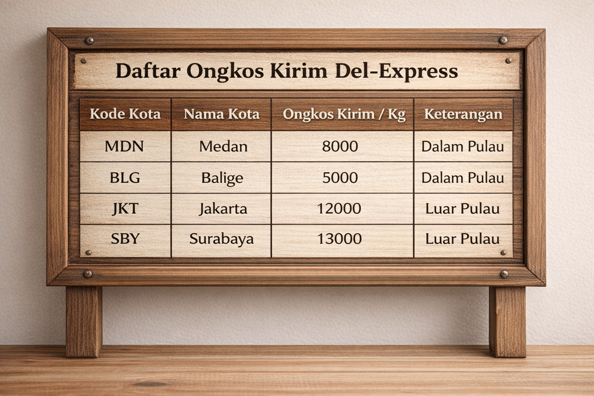
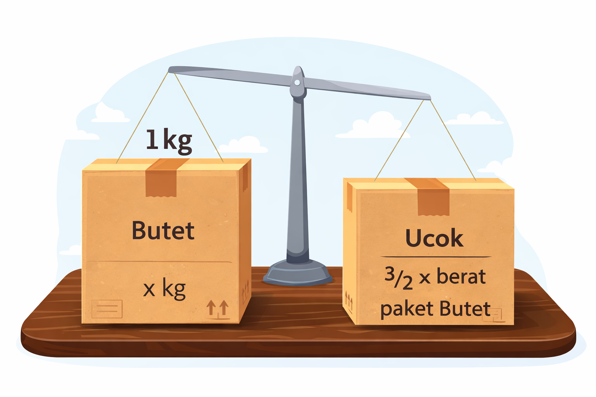
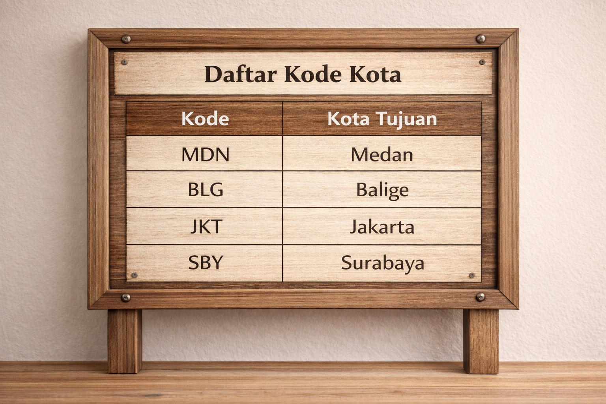

Suatu sore yang cukup sibuk di kampus, dua mahasiswa IT Del, Ucok dan Butet, sedang duduk di depan asrama sambil memandangi beberapa dus besar yang tergeletak di samping mereka. Setelah menyelesaikan minggu yang penuh dengan tugas kuliah dan praktikum, mereka akhirnya punya waktu untuk mengirimkan beberapa barang ke kampung halaman masing-masing.

“Waduh, kalau kita kirim lewat jasa biasa mahal juga ya,” kata Butet sambil menimbang salah satu dus miliknya.

Ucok kemudian tersenyum dan menunjuk sebuah brosur yang ia temukan di papan pengumuman kampus.

“Tenang saja, Tet. Katanya ada jasa pengiriman baru namanya Del-Express. Sistemnya transparan dan perhitungannya otomatis,” ujar Ucok.

Butet langsung terlihat tertarik. “Wah, cocok nih. Kita kan anak IT, masa masih pakai hitung manual!”

Mereka pun berjalan menuju kantor layanan Del-Express yang berada tidak jauh dari kampus. Setibanya di sana, mereka melihat sebuah papan besar berisi daftar ongkos kirim per kilogram ke beberapa kota tujuan.

<p align="center">
  
</p>

Tidak jauh dari papan daftar ongkir, terdapat sebuah poster promo menarik yang ditempel di dinding.

<p align="center">
  
</p>

Saat petugas menimbang paket mereka, ternyata terdapat sedikit perbedaan ukuran dus yang mereka gunakan.
<p align="center">
  
</p>

Petugas Del-Express kemudian menjelaskan bahwa sistem pengiriman mereka bekerja secara otomatis. Petugas hanya perlu memasukkan kode kota tujuan serta berat paket milik Butet, dan sistem akan menghitung seluruh biaya pengiriman termasuk berat paket milik Ucok.
<p align="center">
  
</p>

**Input**

```bash
MDN
5
JKT
3
BLG
4
END

```

**Output**
Struk Pembayaran yang terdiri dari:
Kota tujuan,
Berat paket Butet,
Berat paket Ucok,
Total berat,
Total ongkos kirim,
Informasi promo yang diperoleh,

NB:
Kamu dapat menekan Ctrl + Shift + V untuk melihat soal dengan gambar atau kamu dapat ctrl + Klik pada link gambar.